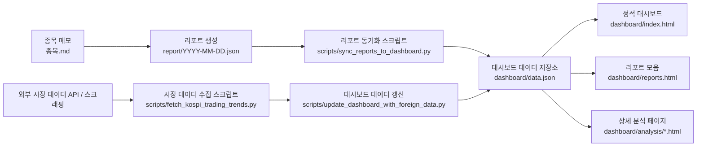

# financeHelper

정적 금융 대시보드와 데이터 수집 파이프라인을 함께 관리하는 금융 워크스페이스입니다.

## 프로젝트 소개

`financeHelper`는 개인 투자 판단에 필요한 리포트와 시장 보조 데이터를 한 화면에서 확인하기 위해 만든 정적 대시보드 프로젝트입니다.
현재는 여기에 Supabase 적재용 데이터 수집기 프로젝트인 `signal-forge/`도 함께 포함합니다.

단순히 화면만 보여주는 프로젝트가 아니라, 아래 세 가지를 함께 다룹니다.

- 일자별 투자 리포트를 누적하고 히스토리로 조회하는 흐름
- 외부 시장 데이터를 별도 수집해 최신 대시보드 데이터에 합치는 흐름
- Supabase로 적재 가능한 정규화 수집 파이프라인 운영 흐름

포트폴리오 관점에서는 "정적 프론트엔드 + Python 데이터 파이프라인 + 운영 가능한 문서화"를 목표로 정리한 프로젝트입니다.

이 워크스페이스는 두 개의 하위 영역으로 나뉩니다.

- 대시보드 앱: `dashboard/`, `report/`, `scripts/`
- 수집 파이프라인: `signal-forge/`

현재 기준 데이터 흐름은 다음 두 갈래입니다.

- `report/*.json`에 일자별 리포트를 저장합니다.
- Python 스크립트가 리포트와 추가 시장 데이터를 `dashboard/data.json`에 반영합니다.
- 정적 HTML 대시보드가 `fetch()` API를 이용해 `dashboard/data.json`을 비동기로 로드하여 화면을 렌더링합니다.
- `signal-forge/`의 collector가 KRX/ECOS/정책 문서를 수집하고 Supabase 정규화 테이블에 적재합니다.

## 핵심 기능

- 일자별 투자 리포트 히스토리 조회
- 보유 종목 / 관심 종목 / 전략 요약 시각화
- 코스피 투자주체 매매 동향 반영
- 기업 분석, 정책 기조, 리포트 모음 등 정적 상세 페이지 제공

## 기술 스택

- Frontend: `HTML`, `CSS`, `Vanilla JavaScript`
- Data Update Scripts: `Python`
- External Data Access: `requests`, `BeautifulSoup`, 외부 금융 API/웹 데이터
- Data Storage: `report/*.json`, `dashboard/data.json`
- Local Run: `python -m http.server`

## 아키텍처



## 디렉터리 구조

```text
financeHelper/
├── signal-forge/
│   ├── collectors/
│   ├── docs/
│   ├── scripts/
│   ├── supabase/
│   └── requirements.txt
├── dashboard/
│   ├── index.html
│   ├── reports.html
│   ├── market-regime.html
│   ├── style.css
│   ├── script.js
│   ├── data.json
│   └── finance_word_data.jsonon
├── report/
│   └── YYYY-MM-DD.json
├── scripts/
│   ├── sync_reports_to_dashboard.py
│   ├── fetch_kospi_trading_trends.py
│   ├── update_dashboard_with_foreign_data.py
│   └── fetch_foreign_investor_trends.py
├── 종목.md
└── README.md
```

## Workspace Roles

### 1. Dashboard App

- 원본: `report/*.json`
- 가공 결과: `dashboard/data.json`
- 목적: 정적 화면 렌더링과 리포트 열람

### 2. Signal Forge Pipeline

- 위치: `signal-forge/`
- 목적: 외부 금융/정책 데이터를 정규화해 Supabase에 적재
- GitHub Actions 워크플로: `.github/workflows/collect-signal-forge.yml`
- 주요 수집기:
  - `signal-forge/collectors/market.py`
  - `signal-forge/collectors/ecos.py`
  - `signal-forge/collectors/policy.py`
  - `signal-forge/collectors/briefs.py`

## 실행 방법

### 1. Python 가상환경 생성

```bash
python3 -m venv .venv
source .venv/bin/activate
pip install -r requirements.txt
```

### 2. 리포트 JSON을 대시보드 데이터에 동기화

`report/` 폴더의 일자별 JSON을 읽어서 `dashboard/data.json`의 `REPORTS_HISTORY`를 갱신합니다.

```bash
python scripts/sync_reports_to_dashboard.py
```

참고:

- 일부 과거 리포트는 현재 대시보드 스키마와 다른 레거시 포맷을 포함합니다.
- 동기화 스크립트는 이런 파일을 현재 대시보드 형식에 맞게 보정하거나 기존 정규화 데이터를 재사용합니다.

### 3. 코스피 매매 동향 데이터 갱신

외부 데이터 소스에서 코스피 투자주체 데이터를 가져와 최신 리포트 항목에 반영합니다.

```bash
python scripts/update_dashboard_with_foreign_data.py
```

직접 수집 결과만 확인하려면:

```bash
python scripts/fetch_kospi_trading_trends.py --json
```

### 4. 정적 대시보드 실행

프로젝트 루트에서 간단한 로컬 서버를 띄운 뒤 브라우저에서 `dashboard/index.html`로 접근합니다.

```bash
python -m http.server 8000
```

브라우저에서 아래 주소를 엽니다.

- `http://localhost:8000/dashboard/index.html`
- `http://localhost:8000/dashboard/reports.html`

## 권장 실행 순서

처음부터 화면까지 확인하려면 아래 순서가 가장 안전합니다.

```bash
source .venv/bin/activate
python scripts/sync_reports_to_dashboard.py
python scripts/update_dashboard_with_foreign_data.py
python -m http.server 8000
```

## 데이터 흐름

### 1. 리포트 데이터

- 원본: `report/YYYY-MM-DD.json`
- 반영 대상: `dashboard/data.json`
- 담당 스크립트: `scripts/sync_reports_to_dashboard.py`

### 2. 시장 보조 데이터

- 원본: 외부 API / 스크래핑 응답
- 반영 대상: `dashboard/data.json` 내 최신 리포트의 `foreignInvestorTrend`
- 담당 스크립트: `scripts/fetch_kospi_trading_trends.py`, `scripts/update_dashboard_with_foreign_data.py`

### 3. 프론트엔드 렌더링

- `dashboard/index.html`이 `dashboard/data.json`, `dashboard/finance_word_data.jsonon`, `dashboard/script.js`를 로드합니다.
- `dashboard/script.js`가 `REPORTS_HISTORY`를 기준으로 섹션별 UI를 렌더링합니다.

## 실행 검증

2026-04-02 기준 아래 항목을 실제로 확인했습니다.

- `.venv` 환경에서 `requirements.txt`의 Python 패키지 import 성공
- `python scripts/sync_reports_to_dashboard.py` 실행 성공
- `python scripts/update_dashboard_with_foreign_data.py` 실행 성공
- `python -m http.server 8000` 실행 후 아래 경로 `200 OK` 확인
  - `http://localhost:8000/dashboard/index.html`
  - `http://localhost:8000/dashboard/reports.html`
  - `http://localhost:8000/dashboard/data.json`

## 의존성

현재 Python 스크립트 기준 필요 패키지:

- `requests`
- `beautifulsoup4`
- `pandas`
- `FinanceDataReader`
- `pretty-errors`

## 트러블슈팅

### 1. 리포트 JSON 형식이 날짜마다 다름

문제:

- 일부 리포트는 현재 대시보드용 객체 형식이 아니라 과거 리스트 형식 또는 단일 종목 딥다이브 형식으로 저장되어 있었습니다.
- 이 때문에 동기화 스크립트가 `dashboard/data.json`를 갱신하는 과정에서 예외가 발생하거나, 최신 대시보드 렌더링이 깨질 수 있었습니다.

대응:

- `scripts/sync_reports_to_dashboard.py`에서 레거시 리스트 포맷을 보정하도록 수정했습니다.
- 대시보드 스키마가 아닌 단일 종목 딥다이브 JSON은 대시보드가 읽을 수 있는 요약 구조로 정규화하도록 처리했습니다.
- 기존 `dashboard/data.json`에 이미 존재하던 추가 필드(`foreignInvestorTrend`)는 날짜 기준으로 다시 병합하도록 유지했습니다.

### 2. 외부 시장 데이터와 일자별 리포트의 갱신 경로가 분리됨

문제:

- 리포트 본문은 `report/*.json`에서 오지만, 외부 시장 데이터는 별도 스크립트가 최신 리포트에 후처리하는 구조입니다.
- 이 흐름을 문서화하지 않으면 실행 순서를 이해하기 어렵습니다.

대응:

- README에 `sync -> update -> serve` 순서를 명시했습니다.
- 아키텍처 다이어그램과 데이터 흐름 섹션에 각 파일의 역할을 분리해 설명했습니다.

## 성과

- 정적 대시보드와 Python 데이터 갱신 스크립트를 연결해, 리포트 생성부터 화면 반영까지 이어지는 일관된 흐름을 만들었습니다.
- 일자별 리포트 히스토리와 외부 시장 데이터를 하나의 대시보드 데이터 소스로 합쳐, 단순 화면 구현이 아니라 운영 가능한 형태로 정리했습니다.
- 실행 문서화와 실제 검증을 통해 `sync -> update -> serve` 순서가 재현 가능하도록 맞췄습니다.
- 과거 리포트의 레거시 포맷과 현재 대시보드 포맷이 섞여 있는 문제를 보정 로직으로 흡수해, 누적 데이터가 쉽게 깨지지 않도록 개선했습니다.

## 배운 점

- 화면 구현만으로는 포트폴리오 설득력이 제한적이고, 실제로는 데이터 구조의 일관성과 실행 재현성이 더 큰 평가 요소가 된다는 점을 확인했습니다.
- JSON 포맷이 날짜별로 달라지면 작은 프로젝트도 빠르게 유지보수 비용이 커지므로, 초기에 데이터 계약을 고정하는 것이 중요하다는 점을 배웠습니다.
- 정적 사이트 구조에서도 데이터 갱신 경로와 실행 순서가 명확하면 충분히 제품처럼 보일 수 있다는 점을 확인했습니다.
- 문서화는 부가 작업이 아니라 구조를 검증하는 과정에 가깝고, README를 정리하는 과정에서 실제 코드의 취약점과 예외 케이스를 더 빨리 발견할 수 있었습니다.

## 참고

- 이 프로젝트는 프레임워크 기반 SPA가 아니라 정적 HTML/CSS/JavaScript 구조입니다.
- 대시보드 데이터의 실제 단일 소스는 현재 `dashboard/data.json`입니다.
- 최신 리포트는 `REPORTS_HISTORY`의 첫 번째 요소를 기준으로 동작합니다.
